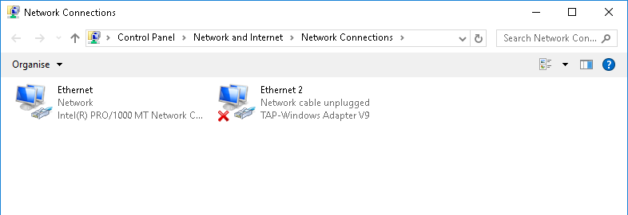

# GALAXY42 compilation on msvc (Visual Studio 2017):

### Process instructions for:

- version:
	```commit 963e23ba9decdf58b1663913b7579132371562e7```
	- It should be similar or easier for newer versions

### Used tools:
- Cygwin (for git)
    - could be other tool that supports git
- Visual Studio Community 2017
- Cmake-GUI 3.9.0

### Cygwin:
```sh
$ git clone https://github.com/yedino/galaxy42
$ echo "REMEMBER TO VERIFY CHECKSUM (git log -1) - git revision hash" ; read _
$ cd galaxy42
$ git submodule update --init
```

### MSVC:
Creating project for Visual Studo (.sln and .vcxproj's) using Cmake-GUI

__Provide dependencies (libboost and libsodium):__
- Pre-compiled binaries can be found on libboost/libsodium official pages.
Download and install/unpack libraries. I used:
    - [Libsodium Releases](https://download.libsodium.org/libsodium/releases/)
    - [Prebuild Boost Binaries For MSVC toolset 14.1](https://sourceforge.net/projects/boost/files/boost-binaries/1.64.0/)

__Open CMake-gui:__
- __Settings:__
	- Where is the source: 		path/to/cloned/galaxy42
	- Where to build the binaries:	any/output/path

__Set cmake variables:__

- Click "Add Entry"
- "Name": BOOST_ROOT, BOOST_LIBRARYDIR, SODIUM_ROOT_DIR
- "Type": PATH
- "Value":
	- for SODIUM_ROOT_DIR: full path to directory, where you install/unpack "Libsodium Releases"
	- for BOOST_ROOT: full path to directory, where you install/unpack "Prebuild Boost Binaries For Windows v.1.6.4"
	- for BOOST_LIBRARYDIR: go to directory, where you install/unpack "Prebuild Boost Binaries For Windows v.1.6.4", open folder (lib32-msvc-14.0/lib64-msvc-14.1 or similar) complies with your system version (x32 or x64) and copy path

```
click configure
* for 32-bit build choose Visual Studio 15 2017
* for 64-bit build choose Visual Studio 15 2017 Win64
click generate
```
__Cmake output:__
```
The C compiler identification is MSVC 19.10.25019.0
The CXX compiler identification is MSVC 19.10.25019.0
Check for working C compiler: C:/Program Files (x86)/Microsoft Visual Studio/2017/Community/VC/Tools/MSVC/14.10.25017/bin/HostX86/x64/cl.exe
Check for working C compiler: C:/Program Files (x86)/Microsoft Visual Studio/2017/Community/VC/Tools/MSVC/14.10.25017/bin/HostX86/x64/cl.exe -- works
Detecting C compiler ABI info
Detecting C compiler ABI info - done
Check for working CXX compiler: C:/Program Files (x86)/Microsoft Visual Studio/2017/Community/VC/Tools/MSVC/14.10.25017/bin/HostX86/x64/cl.exe
Check for working CXX compiler: C:/Program Files (x86)/Microsoft Visual Studio/2017/Community/VC/Tools/MSVC/14.10.25017/bin/HostX86/x64/cl.exe -- works
Detecting CXX compiler ABI info
Detecting CXX compiler ABI info - done
Detecting CXX compile features
Detecting CXX compile features - done
No build type selected, default to Debug
cotire 1.7.9 loaded.
Disabling COVERAGE
EXTLEVEL enabling EXTLEVEL_IS_NORMAL
Looking for pthread.h
Looking for pthread.h - not found
Found Threads: TRUE  
Boost version: 1.64.0
Found the following Boost libraries:
  system
  filesystem
  thread
  date_time
  chrono
  atomic
Boost version variable is: 106400
USE_BOOST_MULTIPRECISION is normal (on)
Found Sodium: C:/msvc2017_libs/libsodium-1.0.13/x64/Debug/v141/dynamic/libsodium.lib  
Found PythonInterp: C:/cygwin64/bin/python (found version "1.4")
Sorting sources (from GLOB)
Libs for crypto are: (as string) ''
Libs for crypto are: (as list) ''
C++ Compiler ID:               MSVC
C Flags:                       /DWIN32 /D_WINDOWS /W3  
C++ Flags:                     /DWIN32 /D_WINDOWS /W3 /GR /EHsc /W4  
C++ link flags:                
Build type:                    Debug
Debug flags:                   /MDd /Zi /Ob0 /Od /RTC1
Release flags:                 /MD /O2 /Ob2
Release with debug info flags: /MD /Zi /O2 /Ob1
Warn pedantic flags:           /W4
Configuring done
```

__Possible errors:__

 ``` Configuring incomplete, errors occurred!```
 ```See also "C:/cygwin64/home/Krystian/galaxy42/CMakeFiles/CMakeOutput.log".'```
- try to delete cache and files by commend in cygwin: rm -rf CMakeCache.txt CMakeFiles/

### Build tunserver.elf.exe in Visual Studio:
- Open Visual Studio, "Open project", choose folder, where you generate MSVC project files
- Open `galaxy42.sln`
- Right mouse button (on "tunserver.elf" in Solution Explorer section) -> Build
- Copy dll library files to binary directory

	For solutions configuration Debug
```
boost_date_time-vc141-mt-gd-1_64.dll
boost_filesystem-vc141-mt-gd-1_64.dll
boost_locale-vc141-mt-gd-1_64.dll
boost_system-vc141-mt-gd-1_64.dll
libsodium.dll
```
	For solutions configuration Release
```
boost_date_time-vc141-mt-1_64.dll
boost_filesystem-vc141-mt-1_64.dll
boost_locale-vc141-mt-1_64.dll
boost_system-vc141-mt-1_64.dll
libsodium.dll
```

__Possible errors:__

```Warning	D9002	ignoring unknown option -std=c++14```
- you should use compilator that support c++14 (probably you are using an older version of Visual Studio)

```Error	LNK1104	cannot open file 'pthread.lib'	tunserver.elf```
- simply remove pthread.lib from linking Additional Dependencies

```Severity	Code	Description	Project	File	Line	Suppression State```
``` Error	LNK2019	unresolved external symbol _CreateUnicastIpAddressEntry@4```
- add Iphlpapi.lib to Additional Dependencies that contain CreateUnicastIpAddressEntry function.

``` Error LNK1112 module machine type 'X86' conflicts with target machine type 'x64' ```
 or
 ``` Error LNK1112 module machine type 'x64' conflicts with target machine type 'X86'```
- make sure you link correct version of 32-bit or 64-bit (libsodium/libboost) libraries.

### Create TUN/TAP device
__download/install openvps drivers for windows tap device__
- [OpenVPN-Downloads](https://openvpn.net/index.php/open-source/downloads.html)

__set up device in windows devices manager (this step must be done as administrator)__
OpenVPN installer creates default one TAP windows adapter. If you need more adapters:

Windows 7

```my computer -> properties -> devices manager -> action -> add old device -> choose manually from list netwotk device -> "TAP-Windows Adapter V9"```

Windows 8 and newer

```my computer -> properties ->device manager -> action -> Add legacy hardware -> Install the hardware that I manually select from a list -> Network adapters -> Have disc -> locate tun driver (default path C:\Program Files\TAP_Windows\driver\OenVista.inf)```

After installing (and restarting) your system will show a virtual network card in addition to your normal network cards:


### Possible runtime errors (tunserver.elf.exe):
***cannon open shared library***
```
	$ ./tunserver.elf.exe
	C:/cygwin/home/Tigu_WIN/msvc/galaxy42/Debug/tunserver.elf.exe: error while loading shared libraries: libsodium.dll: cannot open shared object file: No such file or directory
```
- manually copy libsodium.dll to dir that contain tunserver.elf.exe

- same error with boost libraries - manually copy missing boost libs to dir that contain tunserver.elf.exe

***Windows alert - abort()***

```Microsoft Visual C++ Runtime Library - debug Error! - abort()```
- reason - probably network TAP device is missing or your windows user don't have access to it (Do you created TAP device?).

***problem with TUN/TAP parser***

```tun data length < 54 -- in tunserver.elf.exe debug messages```
- solution: in network device properties for TAP-Windows Adapter V9 - uncheck all components instead of ipv6 protocol
